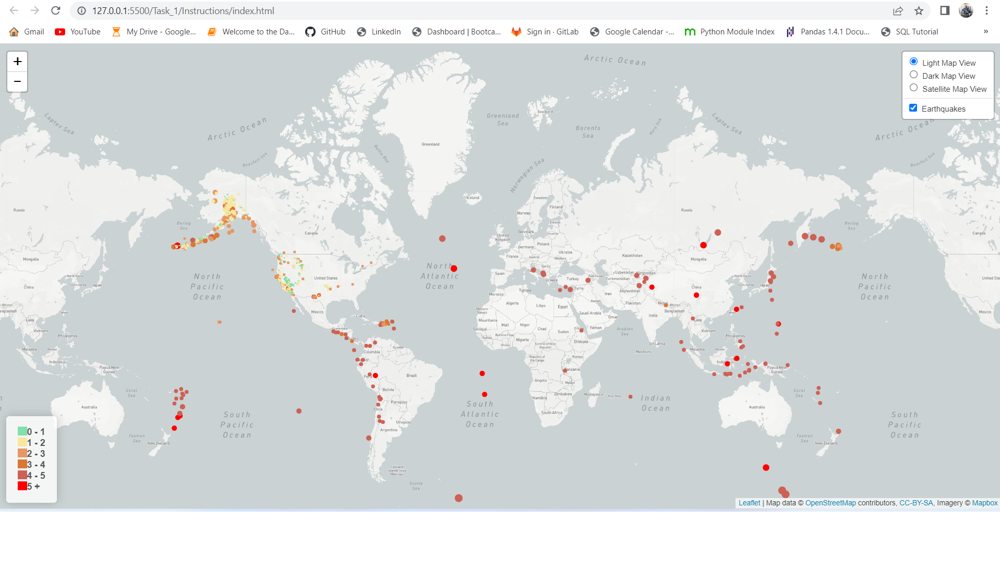
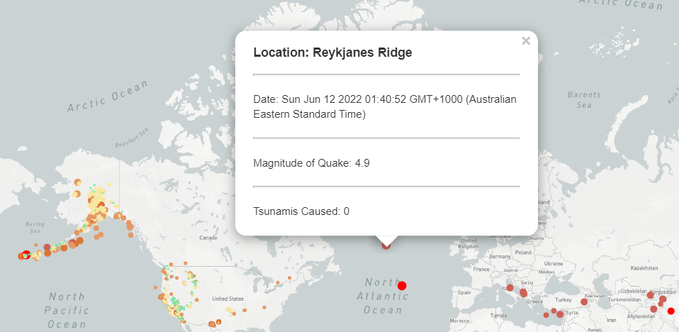
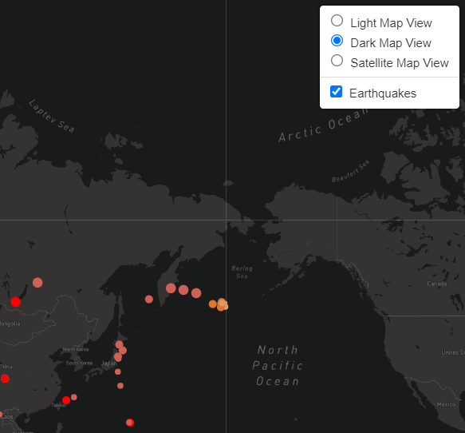
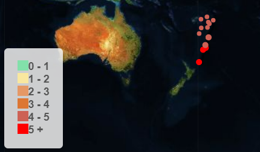
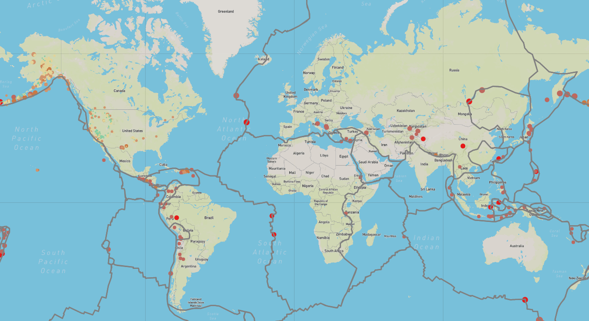
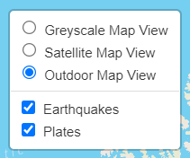

# Leaflet Challenge

    Homework Task 13
    Writen by Chris Burley

## Task Components:

The Leaflet project that you are currently viewing comprises the following key components:

a) This ReadMe file 
b) A folder of Screen Captures 
c) The project folders: Task_1 and Task_2

The latter folders each contains the key files: 

(1) index.html  
(2) app.js   
(3) config.js       

  
# Description:

In this project I have written scripts which, to my knowledge, satisfy every section of the task including that belonging to the BONUS section. 
See screen captures 1 - 6 which I have uploaded to this repository. They show main features that we were required to create.

## Features of this project:

1) Task 1 - The finished product:

2) Task 1 - The popup earthquake information window:

3) Task 1 - The alternative maps tiles I chose to add:

4) Task 1 - The legend I added to the map:

5) Task 2 - The faultines view:

6) Task 2 - The control I added to enable toggling between tiles and overlays:

     
# Support

    For any support with this module, please contact me at chrisjburley@gmail.com
    I would be more than happy to help.

# Contributions

    As this is a piece of work that is going to be assessed, I think that it would be wise for me to suggest that contributions NOT be made to this module.

# Authors and Acknowledgments

    Author - Chris Burley (CJB)
    I would like to thank Brandon Wong from the BSC 24/7 help team for assisting me. I was finding it difficult to import the tectonc plates data and he was able to spot a really tiny error in my code. Bravo!!
